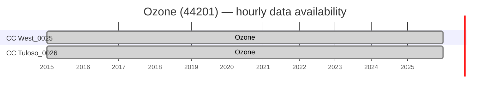
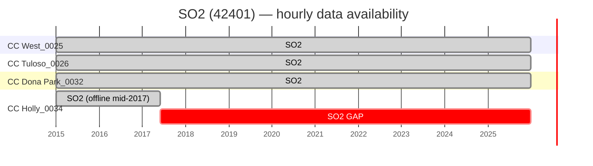
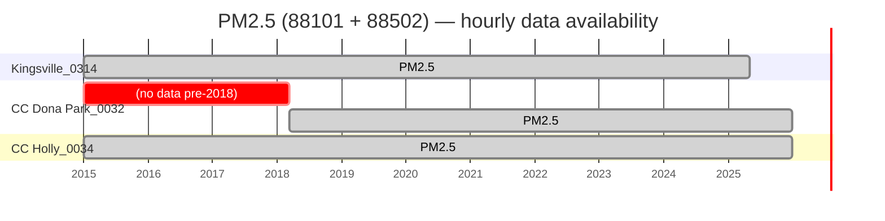
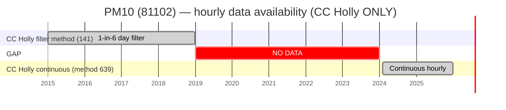
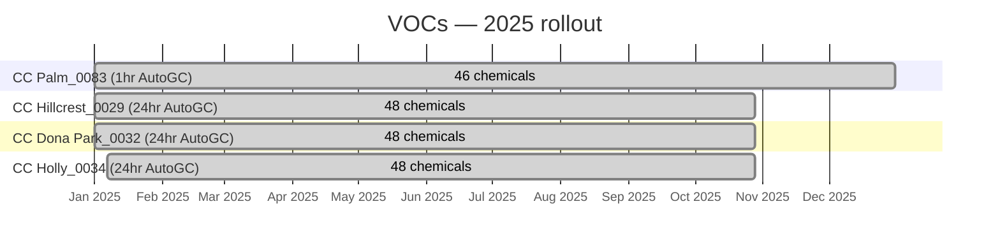

# 04 — Data Availability (Site × Year × Pollutant)

> **This is the single most important reference page for planning any
> analysis on the Coastal Bend dataset.** Every design decision (which
> years to include, which sites to compare, which method changes to
> control for) starts here.

Data snapshot: **2026-07-08** from `aq_coastal_bend.*` on Neon.

## Legend

| Cell | Meaning |
|---|---|
| ✅ **8000+** | Full-year hourly coverage (~90%+ completeness) |
| 🟢 **6000-7999** | Good coverage (~70-90%) |
| 🟡 **3000-5999** | Partial year (~35-70%) — investigate cause |
| 🟠 **500-2999** | Sparse (start-year mid-year or filter-based sampler) |
| 🔴 **1-499** | Minimal (typically 1-in-6 day filter method) |
| ⚫ **0 / blank** | No data |

Maximum possible hourly rows per year: **8760** (8784 in leap years).
For 24hr filter samplers on the standard EPA 1-in-6 day schedule,
expect ~61 rows/year (365/6).

---

## 1. County-level coverage (the headline)

Of the 11 Coastal Bend counties, **only 2** have any TCEQ air quality
monitoring:

| County | FIPS | Active sites | Pollutants measured |
|---|---:|:---:|---|
| Aransas | 007 | **0** ⚫ | — |
| Bee | 025 | **0** ⚫ | — |
| Brooks | 047 | **0** ⚫ | — |
| Duval | 131 | **0** ⚫ | — |
| Jim Wells | 249 | **0** ⚫ | — |
| Kenedy | 261 | **0** ⚫ | — |
| **Kleberg** | **273** | **1** ✅ | PM2.5 |
| Live Oak | 297 | **0** ⚫ | — |
| **Nueces** | **355** | **7** ✅ | Ozone, SO₂, PM2.5, PM10, VOCs |
| Refugio | 391 | **0** ⚫ | — |
| San Patricio | 409 | **0** ⚫ | — |

> **9 of 11 counties (82% of the Coastal Bend region) have no ambient
> air quality monitoring data.** Any inference about air quality in
> those counties must come from spatial interpolation of Nueces + Kleberg
> data. Modeling this from 8 anchor points is a hard problem — see
> [methodology §Interpolation](./07_methodology.md).

---

## 2. Site inventory

| AQSID | Site | County | Lat | Lon | Status | Pollutants (hourly) | VOC cadence |
|---|---|---|---:|---:|---|---|---|
| `482730314` | Kingsville_0314 | Kleberg | 27.4224 | -97.3009 | active | PM2.5 | — |
| `483550025` | Corpus Christi West_0025 | Nueces | 27.7653 | -97.4343 | active | Ozone; SO₂ | — |
| `483550026` | Corpus Christi Tuloso_0026 | Nueces | 27.8324 | -97.5554 | active | Ozone; SO₂ | — |
| `483550029` | Corpus Christi Hillcrest_0029 | Nueces | 27.8076 | -97.4192 | active | — | 24hr |
| `483550032` | Corpus Christi Dona Park_0032 | Nueces | 27.8045 | -97.4316 | active | PM2.5; SO₂ | 24hr |
| `483550034` | Corpus Christi Holly_0034 | Nueces | 27.8118 | -97.4657 | active | PM10; PM2.5; SO₂ | 24hr |
| `483550083` | Corpus Christi Palm_0083 | Nueces | 27.8029 | -97.4199 | active | — | 1hr |
| `483551024` | Williams Park | Nueces | 27.8038 | -97.4138 | **disabled** | — | — |

Coordinates confirmed against TCEQ CAMS + EPA AQS site metadata.

---

## 3. Site × Year × Pollutant Matrix

### 3.1 Ozone (44201) — hourly, unit ppm (normalized from TCEQ ppb)

**Only 2 of 8 sites measure ozone in the Coastal Bend.**

| Site | 2015 | 2016 | 2017 | 2018 | 2019 | 2020 | 2021 | 2022 | 2023 | 2024 | 2025 |
|---|---:|---:|---:|---:|---:|---:|---:|---:|---:|---:|---:|
| CC West_0025 | ✅ 8515 | ✅ 8638 | ✅ 8219 | ✅ 8579 | ✅ 8548 | ✅ 8454 | ✅ 8271 | ✅ 8466 | ✅ 8520 | ✅ 8681 | ✅ 8621 |
| CC Tuloso_0026 | ✅ 8613 | ✅ 8340 | ✅ 8379 | ✅ 8623 | ✅ 8120 | 🟢 7899 | ✅ 8584 | ✅ 8430 | ✅ 8621 | ✅ 8674 | ✅ 8622 |

**Summary:** 2 sites × 11 years = **22 site-years of full ozone coverage**.
Data is exceptionally clean — no gaps, one method code (`87`) throughout
(see [method timelines](./05_method_codes_reference.md#ozone)).

### 3.2 SO₂ (42401) — hourly, unit ppb

| Site | 2015 | 2016 | 2017 | 2018 | 2019 | 2020 | 2021 | 2022 | 2023 | 2024 | 2025 |
|---|---:|---:|---:|---:|---:|---:|---:|---:|---:|---:|---:|
| CC West_0025 | ✅ 8402 | ✅ 8437 | ✅ 8130 | 🟢 7516 | ✅ 8133 | ✅ 8350 | ✅ 8453 | ✅ 8535 | ✅ 8464 | ✅ 8630 | ✅ 8280 |
| CC Tuloso_0026 | 🟢 7984 | ✅ 8032 | 🟢 7630 | 🟢 7519 | ✅ 8203 | ✅ 8286 | 🟢 7867 | ✅ 8149 | 🟡 4636 | 🟡 3523 | ✅ 8329 |
| CC Dona Park_0032 | ✅ 8524 | 🟢 6935 | 🟢 7159 | 🟠 5883 | 🟡 4313 | 🟢 6575 | 🟠 5609 | 🟠 5571 | ✅ 8494 | ✅ 8334 | ✅ 8605 |
| CC Holly_0034 | ✅ 8662 | ✅ 8475 | 🟡 3490 | (gap) | (gap) | (gap) | (gap) | (gap) | (gap) | (gap) | (gap) |

⚠ **CC Holly SO₂ went offline mid-2017.** SO₂ data only exists at Holly
2015-01-01 through 2017-05-31. If SO₂ analysis needs Holly data,
either use 2015–May 2017 only, or exclude Holly from SO₂ studies.

⚠ **CC Tuloso and CC Dona Park have partial-year gaps in several
years.** Investigate whether these are known monitor downtimes in the
TCEQ annual network plans.

### 3.3 PM2.5 (88101 FRM/FEM + 88502 continuous) — hourly, unit µg/m³

| Site | 2015 | 2016 | 2017 | 2018 | 2019 | 2020 | 2021 | 2022 | 2023 | 2024 | 2025 |
|---|---:|---:|---:|---:|---:|---:|---:|---:|---:|---:|---:|
| Kingsville_0314 | ✅ 8567 | 🟡 3866 | ✅ 8332 | ✅ 8346 | 🟢 7023 | ✅ 8081 | ✅ 8424 | ✅ 8444 | 🟢 7956 | ✅ 8488 | 🟠 2891⚠ |
| CC Dona Park_0032 | ⚫ | ⚫ | ⚫ | ✅ 13985* | ✅ 17188* | ✅ 16838* | ✅ 16832* | ✅ 16471* | ✅ 16933* | ✅ 17375* | ✅ 17163* |
| CC Holly_0034 | ✅ 8647 | 🟡 4018 | ✅ 8388 | 🟠 6298 | ✅ 8604 | 🟢 7333 | 🟠 6981 | 🟢 7854 | ✅ 8640 | ✅ 8707 | ✅ 8331 |

`*` CC Dona Park PM2.5 has **~17,000 rows/year** because it runs two
concurrent instruments (88101 FRM + 88502 continuous BAM) reporting to
different POCs — nearly 2 rows per hour.

⚠ **Kingsville 2025 stops at 2025-05-07** (last date in the pull).

⚠ **CC Dona Park PM2.5 starts 2018-03-13** — no earlier data.

### 3.4 PM10 (81102 STP) — hourly, unit µg/m³

| Site | 2015 | 2016 | 2017 | 2018 | 2019 | 2020 | 2021 | 2022 | 2023 | 2024 | 2025 |
|---|---:|---:|---:|---:|---:|---:|---:|---:|---:|---:|---:|
| CC Holly_0034 | 🔴 120† | 🔴 122† | 🔴 61† | 🔴 61† | ⚫ | ⚫ | ⚫ | ⚫ | ⚫ | ✅ 8010‡ | ✅ 8331‡ |

`†` 2015–2018 = 1-in-6 day filter-based sampling (**method 141**, EPA FRM
filter method). Only ~1 sample per 6 days → ~60 rows/year.

`‡` 2024–2025 = continuous hourly sampling (**method 639**, likely BAM or
TEOM). Full hourly coverage.

⚠ **Five-year gap (2019–2023) with NO PM10 data at CC Holly.**
This is a fundamental discontinuity — cross-year trend analysis for PM10
in the Coastal Bend is not scientifically defensible without confronting
this. See [method timelines](./05_method_codes_reference.md#pm10).

⚠ **The pre-2019 and post-2024 sampling methods are not directly
comparable.** Filter-based 24hr integrated samples and continuous
1hr samplers can yield systematically different values.

### 3.5 VOCs — sparse and 2025-only

| Site | Cadence | 2025 rows | Chemicals | Notes |
|---|---|---:|---:|---|
| Corpus Christi Palm_0083 | 1hr AutoGC | **336,922** | 46 | Full-year hourly; the workhorse VOC site |
| Corpus Christi Hillcrest_0029 | 24hr AutoGC | 2,352 | 48 | Every 24hr from 2025-01-01 through 2025-10-28 |
| Corpus Christi Dona Park_0032 | 24hr AutoGC | 2,400 | 48 | Same cadence as Hillcrest |
| Corpus Christi Holly_0034 | 24hr AutoGC | 2,400 | 48 | Started 2025-01-07 |

⚠ **All VOC data is 2025-only in the current pull.** No historical VOC
trend analysis is possible from this dataset. Consider running a
TCEQ TAMIS retro-pull for pre-2025 VOC data before finalizing scope.

---

## 4. Gantt-style timelines (per pollutant)

### 4.1 Ozone



### 4.2 SO₂



### 4.3 PM2.5



### 4.4 PM10



### 4.5 VOCs (2025-only)



---

## 5. NAAQS design values (2023 + 2024)

Design values computed per 40 CFR Part 50 by
`pipeline/step_03_compute_naaqs.py`.

| Site | Metric | Year | Value | NAAQS | Exceeds |
|---|---|---:|---:|---:|:---:|
| CC West_0025 | ozone_8hr_4th_max | 2024 | 0.0664 ppm | 0.070 | — |
| CC Tuloso_0026 | ozone_8hr_4th_max | 2024 | 0.0638 ppm | 0.070 | — |
| CC West_0025 | ozone_8hr_4th_max | 2023 | 0.0640 ppm | 0.070 | — |
| CC Tuloso_0026 | ozone_8hr_4th_max | 2023 | 0.0659 ppm | 0.070 | — |
| Kingsville_0314 | pm25_annual_mean | 2024 | 9.88 µg/m³ | 9.0 | ⚠ **YES** |
| CC Dona Park_0032 | pm25_annual_mean | 2024 | 10.34 µg/m³ | 9.0 | ⚠ **YES** |
| CC Holly_0034 | pm25_annual_mean | 2024 | 11.61 µg/m³ | 9.0 | ⚠ **YES** |
| Kingsville_0314 | pm25_annual_mean | 2023 | 9.33 µg/m³ | 9.0 | ⚠ **YES** |
| CC Dona Park_0032 | pm25_annual_mean | 2023 | 9.47 µg/m³ | 9.0 | ⚠ **YES** |
| CC Holly_0034 | pm25_annual_mean | 2023 | 8.47 µg/m³ | 9.0 | — |
| Kingsville_0314 | pm25_24hr_p98 | 2024 | 32.87 µg/m³ | 35 | — |
| CC Dona Park_0032 | pm25_24hr_p98 | 2024 | 34.20 µg/m³ | 35 | — |
| CC Holly_0034 | pm25_24hr_p98 | 2024 | 39.67 µg/m³ | 35 | ⚠ **YES** |
| CC Holly_0034 | pm10_24hr_exceedances | 2024 | 0 | — | — |
| CC West_0025 | so2_1hr_p99 | 2024 | 4.84 ppb | 75 | — |
| CC Tuloso_0026 | so2_1hr_p99 | 2024 | 1.68 ppb | 75 | — |
| CC Dona Park_0032 | so2_1hr_p99 | 2024 | 16.96 ppb | 75 | — |

**Key findings:**
- **Ozone:** No exceedances at either Coastal Bend site — Corpus Christi
  is below the 0.070 ppm 8-hr NAAQS.
- **PM2.5 annual:** **All three PM2.5 sites exceed the new 2024 EPA
  standard of 9.0 µg/m³** in 2024. Two of three also exceed in 2023.
  This is the headline finding for the Coastal Bend.
- **PM2.5 24hr 98th percentile:** CC Holly exceeded the 35 µg/m³ 24hr
  NAAQS in 2024.
- **SO₂:** Well below the 75 ppb 1-hour NAAQS (highest is Dona Park at
  17 ppb) — no exceedances.
- **PM10:** No exceedances (only CC Holly has data, and only 2024–2025).

---

## 6. Regenerate this data yourself

Every count in this document is derived from
`aq_coastal_bend.*` on Neon. Run any of these queries against the
`AQ_POSTGRES_URL` connection to reproduce.

```sql
-- Site × Year × Pollutant matrix (raw)
SELECT aqsid, site_name, pollutant_group,
       EXTRACT(year FROM date_local::date)::int AS yr,
       COUNT(*) AS n_rows
FROM aq_coastal_bend.pollutant_hourly
GROUP BY aqsid, site_name, pollutant_group, yr
ORDER BY aqsid, pollutant_group, yr;

-- VOCs breakdown
SELECT 'vocs_1hr' AS src, aqsid, site_name,
       COUNT(*) AS n_rows,
       COUNT(DISTINCT parameter_code) AS n_chemicals
FROM aq_coastal_bend.vocs_1hr
GROUP BY aqsid, site_name
UNION ALL
SELECT 'vocs_24hr', aqsid, site_name,
       COUNT(*), COUNT(DISTINCT parameter_code)
FROM aq_coastal_bend.vocs_24hr
GROUP BY aqsid, site_name;

-- Method code timeline per site
SELECT aqsid, site_name, pollutant_group,
       EXTRACT(year FROM date_local::date)::int AS yr,
       method_code, COUNT(*) AS n_rows
FROM aq_coastal_bend.pollutant_hourly
GROUP BY aqsid, site_name, pollutant_group, yr, method_code
ORDER BY aqsid, pollutant_group, yr, method_code;
```

For a Python + pandas + matplotlib version that regenerates the mermaid
Gantt charts and the color-coded matrix, see the helper notebook that
will land with the first analysis PR (`notebooks/data_availability.ipynb`
in the project tree; not yet on the docs site).
