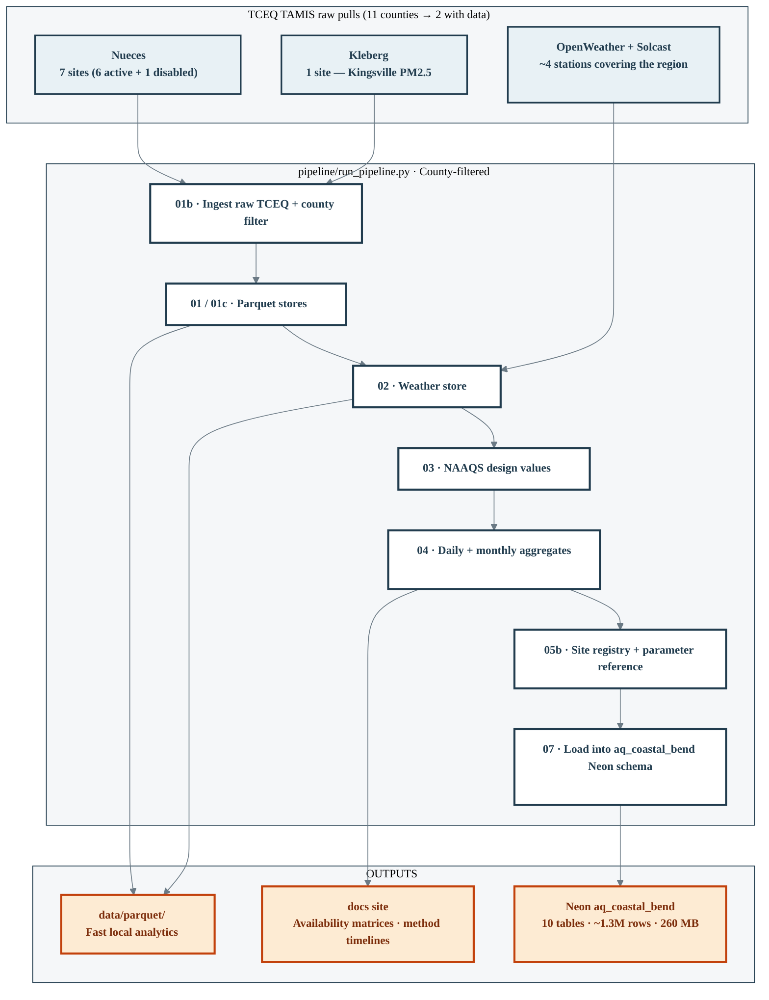

---
hide:
  - toc
---

# Coastal Bend Air Quality Data Pipeline

Melaram Lab
v0.1.0

!!! info "About this project"

    A reproducible, config-driven data pipeline for ambient air quality
    monitoring across the **Coastal Bend region of South Texas** (11 counties,
    2015–2025). Scoped in from the broader
    [South Texas AQ pipeline](https://aidanjmeyers.github.io/south-texas-aq-pipeline/)
    to enable a focused Corpus Christi–anchored analysis with strict
    scientific integrity around instrumentation and method-code changes.

    **Lab:** Melaram Lab, Texas A&M University–Corpus Christi
    **Principal Investigator:** Dr. Rajesh Melaram, TAMU-CC
    **Lead Developers:** Aidan Meyers, Manassa Kuchavaram, Jasmine Trevino
    **Contact:** [aidan.meyers@tamucc.edu](mailto:aidan.meyers@tamucc.edu) · [www.melaramlab.com](https://www.melaramlab.com)
    **License:** MIT

## The single most important fact about this dataset

!!! danger "9 of the 11 Coastal Bend counties have NO ambient air quality monitors"

    Only **2 counties** in the Coastal Bend region have TCEQ-networked
    monitoring sites: **Nueces (7 sites)** and **Kleberg (1 site)** —
    for a total of **8 sites**. The other 9 counties (Aransas, Bee, Brooks,
    Duval, Jim Wells, Kenedy, Live Oak, Refugio, San Patricio) have no
    monitoring data during 2015–2025. Any inference about air quality in
    those counties requires spatial interpolation from Nueces + Kleberg,
    which is a hard modeling problem with only 8 anchor points.

    This drives every design decision below.

## What's in the pipeline

!!! abstract "At-a-glance numbers (v0.1.0)"

    | Count | What |
    |---:|---|
    | **11** | Coastal Bend counties in scope |
    | **2** | Counties with active monitoring (Nueces, Kleberg) |
    | **8** | Total monitoring sites (7 active + 1 disabled) |
    | **5** | Pollutant groups measured (Ozone, SO₂, PM2.5, PM10, VOCs) |
    | **0** | Sites measuring CO or NOx in the Coastal Bend |
    | **~1.3M** | Total data rows across all Neon tables |
    | **~9 min** | Full local rebuild runtime |
    | **~5 min** | Neon reload runtime |

## Start here

-   :material-map-marker-radius: **Data reality first**

    ---

    Before you plan any analysis, [read the availability matrix](./04_data_availability.md).
    It shows exactly which site has which pollutant in which year — with
    color-coded completeness and method-code changes over time.

-   :material-format-list-bulleted-square: **Method code timelines**

    ---

    [Every method-code change per site](./05_method_codes_reference.md), including
    the CC Holly PM10 gap (2019–2023) and the 2024 method switch (141 → 639).

-   :material-database: **Neon SQL access**

    ---

    [Connect Colab / Python / R / BI tools](./08_usage_neon.md) to the
    `aq_coastal_bend` schema — same credentials as the broader
    `AQ_POSTGRES_URL`.

-   :material-flask: **Pollutant deep-dives**

    ---

    Team-authored technical briefings on each pollutant: chemistry,
    instrumentation, NAAQS, method codes, meteorological drivers.
    [Ozone](./pollutants/ozone.md) · [SO₂](./pollutants/so2.md) ·
    [PM2.5](./pollutants/pm25.md) · [VOCs](./pollutants/vocs.md) · …

## Team assignments (from 2026-07-08 meeting)

| Pollutant | Lead | Deliverable |
|---|---|---|
| Ozone | Manasseh Kuchavaram | [pollutants/ozone.md](./pollutants/ozone.md) |
| CO | Manasseh Kuchavaram | [pollutants/co.md](./pollutants/co.md) — flagged: no CO sites in Coastal Bend |
| PM2.5 | Aidan Meyers | [pollutants/pm25.md](./pollutants/pm25.md) |
| PM10 | Aidan Meyers | [pollutants/pm10.md](./pollutants/pm10.md) |
| NOx family | Aidan Meyers | [pollutants/nox.md](./pollutants/nox.md) — flagged: no NOx sites in Coastal Bend |
| SO₂ | Jasmine Trevino | [pollutants/so2.md](./pollutants/so2.md) |
| VOCs | Jasmine Trevino | [pollutants/vocs.md](./pollutants/vocs.md) |

Each page is a **structured template** — chemistry / instrumentation /
NAAQS / parameter codes / method codes over time / meteorological drivers /
literature review — that the lead fills in as they research their pollutant.

## Relationship to the South Texas AQ pipeline

This project is a **county-filtered fork** of the broader
[South Texas AQ pipeline](https://github.com/AidanJMeyers/south-texas-aq-pipeline)
(v0.4.0, 42 sites across 13 counties). The rationale for scoping in:

1. **Focus** — Dr. Melaram wants a publishable Coastal Bend analysis as
   the first output.
2. **Method rigor** — with 8 sites we can genuinely audit every method
   code change and comment on cross-year comparability. Not possible at
   42-site scale in the same timeframe.
3. **Publishable scope** — the Coastal Bend has a coherent industrial
   footprint (Port of Corpus Christi refining / petrochemical corridor)
   that makes for a clean geographic frame.
4. **Extensibility** — the pipeline still works at the full 42-site
   scale. Coastal Bend is a `COASTAL_BEND_COUNTIES` filter on top of it.

## Pipeline version history

| Version | Date | Summary |
|---|---|---|
| 0.1.0 | 2026-07-08 | Initial Coastal Bend fork of south-texas-aq v0.4.0. County-filtered Neon schema `aq_coastal_bend`. Availability matrices + method-code timelines documented. |

---

  <strong>Melaram Lab</strong> · Texas A&amp;M University–Corpus Christi
   
  <a href="https://www.melaramlab.com">www.melaramlab.com</a>
  ·
  <a href="https://github.com/AidanJMeyers/coastal-bend-aq">GitHub</a>

