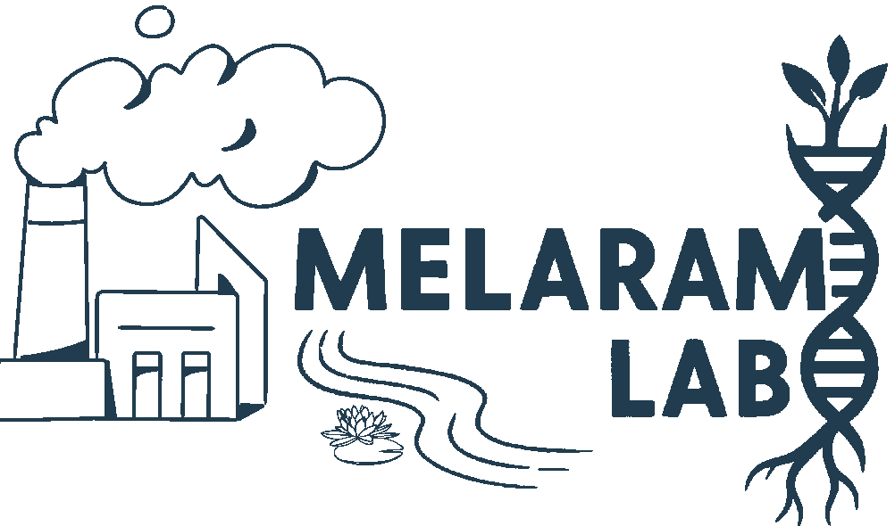
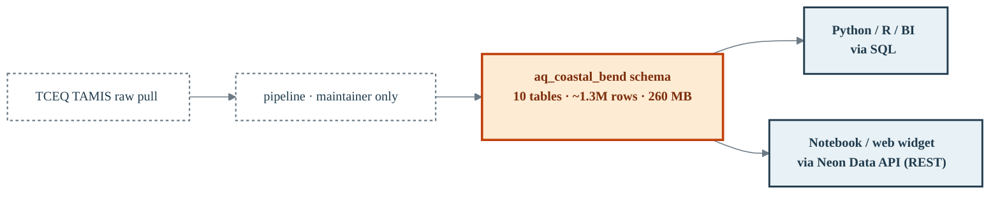

---
hide:
  - toc
---



# Coastal Bend Air Quality Data Pipeline

<span class="brand-badge">Melaram Lab</span>
<span class="brand-badge brand-badge-accent">v0.1.4</span>

!!! info "About this project"

    Reproducible ambient air quality database for the **Coastal Bend
    region of South Texas** (11 counties, 2015–2025). Every observation
    is exposed through the Neon `aq_coastal_bend` schema — query it
    via SQL or the Neon Data API. Team members and collaborators do
    **not** need to run any pipeline locally.

    **Lab:** Melaram Lab, Texas A&M University–Corpus Christi
    **Principal Investigator:** Dr. Rajesh Melaram, TAMU-CC
    **Leads:** Aidan Meyers, Manasa Kuchavaram, Jasmine Trevino
    **Contact:** [aidan.meyers@tamucc.edu](mailto:aidan.meyers@tamucc.edu)
    **License:** MIT

## The single most important fact about this dataset

!!! danger "9 of the 11 Coastal Bend counties have NO ambient air quality monitors"

    Only **2 counties** in the Coastal Bend region have TCEQ-networked
    monitoring sites: **Nueces (7 sites)** and **Kleberg (1 site)** —
    for a total of **8 sites**. The other 9 counties (Aransas, Bee,
    Brooks, Duval, Jim Wells, Kenedy, Live Oak, Refugio, San Patricio)
    have no monitoring data during 2015–2025.

    Any inference about air quality in those counties requires spatial
    interpolation from Nueces + Kleberg, which is a hard modeling
    problem with only 8 anchor points. This drives every design
    decision below.

## The database is the deliverable

Everyone on the team queries the **`aq_coastal_bend`** schema on Neon.
Nothing to install, nothing to download, nothing to build locally.

```python
import os, pandas as pd
from sqlalchemy import create_engine

engine = create_engine(os.environ['AQ_POSTGRES_URL'], pool_pre_ping=True)

pd.read_sql("""
    SELECT site_name, metric, ROUND(value::numeric, 4) AS value, exceeds
    FROM   aq_coastal_bend.naaqs_design_values
    WHERE  year = 2024
    ORDER  BY exceeds DESC, value DESC
""", engine)
```

Full connection setup + REST API alternative in
[08 Neon access](./08_usage_neon.md). Python + R cookbook in
[09 Python & R examples](./09_usage_python_r.md).



!!! abstract "At-a-glance numbers"

    | Count | What |
    |---:|---|
    | **11** | Coastal Bend counties in scope |
    | **2** | Counties with active monitoring (Nueces, Kleberg) |
    | **8** | Total monitoring sites (7 active + 1 disabled) |
    | **5** | Pollutant groups measured (Ozone, SO₂, PM2.5, PM10, VOCs) |
    | **0** | Sites measuring CO or NOx in the Coastal Bend |
    | **10** | Tables in `aq_coastal_bend` on Neon |
    | **~1.3M** | Rows across those tables |
    | **~260 MB** | Storage on Neon |

## Start here

<div class="grid cards" markdown>

-   :material-database: **Connect to the database**

    ---

    [Get your Neon connection](./08_usage_neon.md) and pull your first
    result set in 60 seconds.

-   :material-map-marker-radius: **Data reality first**

    ---

    Before you plan any analysis, [read the availability matrix](./04_data_availability.md).
    It shows exactly which site has which pollutant in which year —
    with color-coded completeness and method-code changes over time.

-   :material-format-list-bulleted-square: **Method code timelines**

    ---

    [Every method-code change per site](./05_method_codes_reference.md),
    including the CC Holly PM10 gap (2019-2023) and the 2024 method
    switch (141 → 639).

-   :material-clipboard-text-clock: **Meeting notes + action items**

    ---

    [Weekly team meeting minutes](./meeting_notes/index.md) with
    checkbox action items. The [2026-06-24 scope-pivot
    meeting](./meeting_notes/2026-06-24.md) is the founding entry.

-   :material-progress-check: **Pipeline updates**

    ---

    [Running log](./pipeline_updates.md) of every change to the
    database, docs, or team decisions — what, when, why, where the
    current product lives.

-   :material-flask: **Pollutant deep-dives**

    ---

    Team-authored technical briefings:
    [Ozone](./pollutants/ozone.md) · [SO₂](./pollutants/so2.md) ·
    [PM2.5](./pollutants/pm25.md) · [PM10](./pollutants/pm10.md) ·
    [VOCs](./pollutants/vocs.md) · [CO](./pollutants/co.md) ·
    [NOx](./pollutants/nox.md)

</div>

## Team assignments (2026-06-24 meeting)

| Pollutant | Lead | Status |
|---|---|---|
| Ozone | Manasa Kuchavaram | ✅ [deep-dive published](./pollutants/ozone.md) (v0.1.3) |
| CO | Manasa Kuchavaram | ✅ [gap statement published](./pollutants/co.md) — awaiting strategic-option decision |
| PM2.5 | Aidan Meyers | ✅ [deep-dive published](./pollutants/pm25.md) (v0.1.3) |
| PM10 | Aidan Meyers | ✅ [deep-dive published](./pollutants/pm10.md) (v0.1.3) |
| NOx family | Aidan Meyers | ✅ [gap statement published](./pollutants/nox.md) — TROPOMI recommended, awaiting confirm |
| SO₂ | Jasmine Trevino | ✅ [deep-dive published](./pollutants/so2.md) (v0.1.3) |
| VOCs | Jasmine Trevino | ✅ [deep-dive published](./pollutants/vocs.md) (v0.1.3) |

Full detail on [11 Team assignments](./11_team_assignments.md) and the
[open action-item roll-up](./meeting_notes/index.md#master-action-item-status).

## Relationship to the South Texas AQ pipeline

This project is a **county-filtered fork** of the broader
[south-texas-aq v0.4.0 pipeline](https://github.com/AidanJMeyers/south-texas-aq-pipeline)
(42 sites, 13 counties). Both live in the same Neon project; the full
South Texas data stays queryable as the `aq` schema (versus
`aq_coastal_bend` here).

Why the fork:

1. **Focus** — Dr. Melaram wants a publishable Coastal Bend analysis
   as the first output.
2. **Method rigor** — with 8 sites we can genuinely audit every method
   code change and comment on cross-year comparability.
3. **Publishable scope** — the Coastal Bend has a coherent industrial
   footprint (Port of Corpus Christi refining / petrochemical
   corridor) that makes for a clean geographic frame.
4. **Extensibility** — the pipeline still works at the full 42-site
   scale. Coastal Bend is a `COASTAL_BEND_COUNTIES` filter applied
   on top of it.

## Latest changes

See the [Pipeline Updates](./pipeline_updates.md) page. Newest entry:

- **2026-07-15 · v0.1.4** — Correction pass on 2026-07-08 meeting notes
  (was the PPT-briefings meeting, not a BREATHE-CC crossover as I first
  wrote) + [2026-07-15 pollution-rose → Refinery-Row directional health
  study pivot](./meeting_notes/2026-07-15.md) + [full scope
  doc](./proposals/refinery_row_directional_health.md) + Warden/Jin
  meeting-poll email draft.

---

<div style="text-align: center; margin-top: 3em; color: #555555;">
  <strong>Melaram Lab</strong> · Texas A&amp;M University–Corpus Christi
  <br/>
  <a href="https://www.melaramlab.com">www.melaramlab.com</a>
  ·
  <a href="https://github.com/AidanJMeyers/coastal-bend-aq">GitHub</a>
</div>
