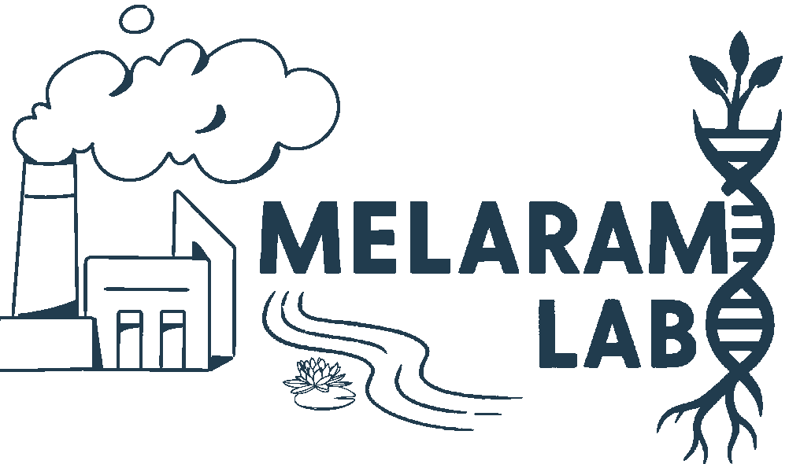

---
hide:
  - toc
---

# Coastal Bend Air Quality Data Pipeline

Melaram Lab
v0.1.12

Reproducible ambient air quality database + Random-Forest × pollution-rose
analysis for **Nueces County — Corpus Christi Refinery Row corridor**,
2015–2025.

**Study:** *Directional pollutant-transport modelling downwind of the Port
of Corpus Christi refinery corridor.* Random-Forest predictions of
transport direction + concentration for SO₂, O₃, and PM2.5, with the
model output rendered as pollution roses. Full context in the
[Refinery-Row scope doc](./proposals/refinery_row_directional_health.md).

**Lab.** Melaram Lab · Texas A&M University–Corpus Christi ·
[www.melaramlab.com](https://www.melaramlab.com)
**PI.** Dr. Rajesh Melaram
**Leads.** Aidan Meyers · Manasa Kuchavaram · Jasmine Trevino

---

## Start here — pick one

-   :material-file-document-outline: **Study scope + design**

    ---

    The one-pager that anchors the project. Research questions,
    hypotheses, variables, methods, timeline. Read this first if you're
    new to the team.

    [Refinery-Row scope doc →](./proposals/refinery_row_directional_health.md)

-   :material-database: **Query the data (Neon)**

    ---

    All observations live in the `aq_coastal_bend` schema. SQL or REST
    API. Nothing to install locally.

    [Neon access →](./08_usage_neon.md) · [Python / R cookbook →](./09_usage_python_r.md)

-   :material-map-marker-radius: **Site map + data reality**

    ---

    Figure 1 — refinery corridor, monitors, and per-site coverage.
    Read before planning any analysis.

    [Site map & availability →](./04_data_availability.md)

-   :material-clipboard-text-clock: **Meetings & updates**

    ---

    Every meeting's notes have action items right in the body.
    Pipeline changes are logged separately in the changelog.

    [Meetings archive →](./meeting_notes/index.md) ·
    [Pipeline changelog →](./pipeline_updates.md)

-   :material-book-multiple: **Team skills (download)**

    ---

    Claude Code skills for the team. Study context + paper
    annotation. Install locally to give your Claude the same shared
    knowledge base.

    [Skills page →](./skills.md)

---

## What's on the site

The nav at the top groups pages by role: **Data**, **Analysis**,
**Pipeline**, **Meetings & Updates**, **Access**. If you know what
you're looking for, use the search box (top-right). If you don't,
the four cards above cover ~90 % of what people actually visit.

The single most important fact about this dataset — before you plan
any analysis, plumb this constraint into your assumptions:

!!! danger "9 of the 11 Coastal Bend counties have NO ambient air quality monitors"

    Only Nueces (7 sites) and Kleberg (1 site) are monitored. Any
    inference about the other 9 counties requires spatial
    interpolation from 8 anchor points — a hard problem that shapes
    every downstream design decision. See [Data availability](./04_data_availability.md)
    for the site inventory.

---

  <strong>Melaram Lab</strong> · Texas A&amp;M University–Corpus Christi
  · <a href="https://www.melaramlab.com">www.melaramlab.com</a>
  · <a href="https://github.com/AidanJMeyers/coastal-bend-aq">GitHub</a>
  · <a href="./pipeline_updates.md">changelog</a>

