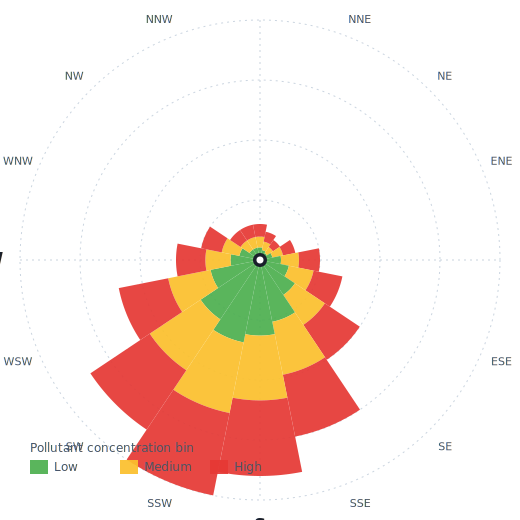

# Proposal — Refinery-Row Directional Health-Outcome Study

**Working title.** *Directional exposure attribution and predictive
modelling of pollution-driven health exacerbations downwind of the Port
of Corpus Christi refinery corridor: a coastal-breeze-informed
geospatial-temporal analysis.*

**Origin.** [2026-07-15 team meeting](../meeting_notes/2026-07-15.md).
The proposal is a team synthesis:

- **Jasmine Trevino — foundational insight.** Introduced the
  **pollution-rose** framing (wind-rose analytics extended to show
  where each pollutant is *heading* at what severity). This is the
  anchor idea the rest of the design builds on. Jasmine also
  independently verified — with NWS Corpus Christi — that the Gulf
  sea-breeze pattern is uniform enough across the Coastal Bend for a
  single regional rose per pollutant per season to be scientifically
  defensible.
- **Manasa Kuchavaram — refinery-centering.** Proposed centering the
  pollution-rose analysis on the Port of Corpus Christi refinery
  corridor and pointed the team at R's
  [`openair`](https://davidcarslaw.github.io/openair/) package as the
  ready-made implementation path.
- **Aidan Meyers — ML + health-outcome coupling.** Extended the framing
  into a residential-zone-level health-exacerbation prediction problem
  at day/week/month temporal resolution.
- **Dr. Rajesh Melaram — grant + significance framing.** Immediately
  identified the design as the fix for the previously-denied
  climate-change seed grant (denied on feasibility, high on novelty +
  significance) and the R25 track.

**Status.** Consensus direction agreed at 2026-07-15. Awaiting novelty
+ feasibility scan (due 2026-07-22) and joint consult with
Dr. Warden + Dr. Jin (poll going out this week).

**Team leads (equal weight).** Aidan Meyers, Manasa Kuchavaram, Jasmine
Trevino. Additional foundational credit to Jasmine for the
pollution-rose framing without which the proposal does not exist.

**Timeline.** 1 to 1.5 years to first manuscript submission. Deliberately
not a fast paper — the multi-dimensional analysis needs the time.

<figure markdown>
  { width=440 }
  <figcaption><em>Illustrative pollution rose.</em> Each wedge points
  in the direction the wind is <strong>coming from</strong>; wedge
  length shows how frequently wind blows from that sector; wedge color
  bins represent pollutant concentration (green low → yellow medium
  → red high). The pattern here reflects the Corpus Christi Gulf-breeze
  regime — dominant winds from S / SSW — which is what the
  Refinery-Row design leverages. For real, data-driven examples see
  the <a href="https://davidcarslaw.github.io/openair/">openair R
  package</a>.</figcaption>
</figure>

---

## 1. The one-sentence pitch

> Combine wind-direction data with pollutant flow from **Refinery Row** in
> Nueces County into a directional exposure axis, then predict
> residentially-zoned respiratory + cardiovascular exacerbations at day /
> week / month temporal resolution — a machine-learning study of a real
> point source, not a diffuse regional correlation.

## 2. Why this study is different (novelty case)

Almost every air-pollution health study reduces exposure to a **scalar
concentration at a point**. This proposal converts exposure to a
**directional vector from a known industrial point source**, then asks
whether that vector predicts *where and when* exacerbations occur.

Five dimensions of analysis, not three:

1. **Residential zone** (spatial, discrete).
2. **Time** (temporal, high-resolution: hour → day → week → month).
3. **Wind direction from Refinery Row** at time T (angular, continuous).
4. **Pollutant concentration + speciation** at time T (multivariate).
5. **Health outcome** at time T + Δ (the target).

**What we can say that other studies can't:**

- *Point-source attribution* — Refinery Row is a real, identifiable,
  legally-designated industrial corridor. Not a diffuse regional
  proxy.
- *Temporal resolution of the effect* — plume-scale (hours to days),
  not just seasonal averages.
- *Coastal-breeze effect quantification* — the literature has hypotheses
  but little clean evidence; this design can produce direct measurement.
- *Result-robust framing* — a null finding is publishable too, speaking
  to whether the sea breeze is *protective* for corridor communities.

## 3. Research questions

**Primary.**
Does wind-direction × pollutant-flow from Refinery Row at time T
significantly predict acute respiratory and cardiovascular
exacerbations (ED visits, hospitalizations) at downwind residential
zones at time T + Δ (Δ ∈ hours, days, weeks)?

**Secondary.**
1. Which pollutant(s) mediate the effect most strongly (SO₂, VOCs, PM2.5,
   ozone secondary formation)?
2. What is the optimal Δ (temporal lag) between plume arrival and
   exacerbation?
3. Does the Gulf sea breeze **attenuate** the exposure signal (protective
   effect) or **redistribute** it (transport downwind)?
4. Do seasonal patterns hold year-over-year (2015–2025) or has the
   pattern *phase-shifted* over time? (Phase-shift hypothesis borrowed
   from a Chinese COVID-19 paper introduced by Dr. Miller earlier this
   semester — Aidan to relocate + cite.)

## 4. Exposure axis (novel construct)

For each observation-timestamp (hourly), compute:

- **Wind vector** (speed + direction) at the nearest weather station.
- **Angular offset from Refinery Row → residential zone** for each zone
  in the study region.
- **Downwind indicator** — is the zone within a cone of X° from the
  wind vector originating at Refinery Row?
- **Effective concentration at the zone** — Gaussian plume approximation
  or empirical decay from the nearest monitor, weighted by wind speed.
- **Pollutant composition vector** — SO₂, VOCs (speciated), PM2.5, and
  ozone from the nearest monitor at the same timestamp.

The pollution rose is the *visualization* of this construct across time;
the exposure axis is the *quantitative* version fed into the model.

**Implementation:** R [`openair`](https://davidcarslaw.github.io/openair/)
package for the pollution-rose analytics; custom scripts for the
directional-cone and plume-approximation calculations.

## 5. Outcomes (dependent variables)

Candidate ED / hospitalization outcomes, at residential-zone × time
resolution:

- Asthma exacerbations (ICD-10 J45.x).
- COPD exacerbations (J44.x).
- Acute bronchitis (J20).
- Cardiovascular incidents (I20–I25, I50).
- All-cause respiratory admissions (J00–J99).
- Optional secondary: neonatal / obstetric outcomes (Bekkar 2020
  framework — PM2.5 & preterm birth).

**Data source options** — feasibility scan is an open action item:

- Texas HHSC hospital discharge dataset (statewide, residentially
  geocoded, requires DUA).
- TDSHS emergency-department datasets.
- Local hospital consortium (Corpus Christi + surrounding) — may be
  faster access.
- BREATHE-CC pediatric cohort (Melaram Lab) — direct handoff, small
  cohort but perfectly geocoded and consented.

## 6. Data availability check (from 2026-07-15 meeting)

| Pollutant | Coverage rating for this study | Notes |
|---|---|---|
| Ozone | 🟢 Strong | CC West + CC Tuloso, 2015–2025 continuous |
| SO₂ | 🟢 Strong | 3 active sites; CC Holly offline mid-2017 |
| PM2.5 | 🟡 Fair | 3 sites; Kingsville site status uncertain |
| PM10 | 🟡 Fair | CC Holly with 5-yr instrument gap; Saharan-dust confound |
| VOCs | 🔴 Limited | 2025-only in current pull — VOC retro-pull decision now urgent |
| CO | ⚫ N/A | Dropped from first-manuscript scope at 2026-07-08 |
| NOₓ | ⚫ N/A | No monitors in Coastal Bend; TROPOMI satellite would be a supplementary layer |

Weather + wind data: Nueces + Kleberg NWS + local stations, hourly,
2015–2025. Sea-breeze pattern uniform across Coastal Bend per Jasmine
(NWS verified).

## 7. Methods overview (v0 for external consult)

1. **Data harmonization** — pull `aq_coastal_bend.pollutant_hourly` +
   `weather_hourly`; join on aqsid + timestamp. Preserve method_code per
   row (2026-07-08 action item).
2. **Residential-zone definition** — Texas ZCTA (ZIP Code Tabulation
   Area) or Census tract; use whichever the health outcome dataset
   supports natively.
3. **Refinery Row coordinate** — centroid of the Port of Corpus Christi
   industrial corridor (specific coordinates TBD; likely a polygon,
   not a point).
4. **Directional cone assignment** — for each (zone, timestamp) pair,
   compute whether the zone is downwind of Refinery Row and how strongly
   (angular alignment × wind speed).
5. **Effective concentration modelling** — Gaussian plume or empirical
   decay; validate against nearest-monitor observations.
6. **Pollution-rose descriptive figures** — per pollutant, per season,
   per year. Test the phase-shift hypothesis.
7. **ML predictive model** — the target is health-outcome incidence at
   zone × time. Features: exposure axis + weather + zone demographics +
   seasonality. Candidate models: gradient-boosted trees (XGBoost /
   LightGBM), temporal CNN, or hierarchical Bayesian regression — final
   choice per Dr. Warden + Dr. Jin's recommendation.
8. **Sensitivity analyses** — vary Δ (temporal lag); vary the
   directional-cone width; drop-one-pollutant analyses; seasonal
   subsets; pre-vs-post-COVID phase-shift test.
9. **Manuscript methods paragraph per pollutant** — already an in-flight
   action; will be lifted directly from the deep-dive pages.

## 8. Team + collaborators

### Core team (equal-weight leads)

- **Jasmine Trevino** — meteorology + wind analytics + SO₂ deep-dive;
  originator of the pollution-rose framing that anchors this proposal;
  primary lead on the wind-direction and pollution-rose analytics.
- **Manasa Kuchavaram** — chemistry + ozone deep-dive + literature
  review; originator of the refinery-centering approach; primary lead
  on ozone + `openair` implementation.
- **Aidan Meyers** — pipeline engineering + ML modelling + PM/VOC
  deep-dive; primary lead on the health-outcome coupling and
  exposure-axis construct.
- **Dr. Rajesh Melaram** — PI; health-outcome framing, grant strategy,
  translation to policy.

### To loop in for the joint consult

- **Dr. Warden** — methodological / stats.
- **Dr. Jin** — methodological / stats.
- **Jasmine's atmospheric-physics mentor** (Melaram Lab has not
  collaborated with him yet) — atmospheric-physics consult, especially
  on how directionality should be encoded for the ML model.

**Meeting plan.** Aidan is sending a Schej.it poll for the next 2 weeks
(2026-07-15 to 2026-07-29) to schedule the joint session.

## 9. Publication + policy framing

- **Target journal** — higher-impact than our previous submission.
  Candidates depend on the strength of the signal: Environmental Health
  Perspectives (impact ≈ 10), Environmental Research (≈ 8), Environment
  International (≈ 12–13), or if the design holds up rigorously,
  possibly a general-audience journal (Nature Communications, PNAS
  section).
- **Policy angle** — refinery-corridor communities' health outcomes as a
  function of *when* the wind blows industrial pollution over them.
  Directly actionable for:
  - Corpus Christi + Nueces County zoning.
  - Texas Commission on Environmental Quality (TCEQ) monitoring
    strategy.
  - EPA facility-permitting reviews.
- **Grant reuse.** The climate-change seed grant that Dr. Melaram
  submitted (denied on feasibility, high on novelty + significance)
  directly addresses this study's shape. Resubmit anchored on this
  proposal.

## 10. Comparison paper the team will position against

Search-and-comment target: the **Houston longitudinal PM study** the
team cited in the last paper. It did not discuss instrument changes;
ours will. It did not do directional exposure attribution; ours will.
Systematic comparison in the discussion section positions our
methodological contributions.

## 11. Deliverables

- **v1 (2026-07-22 team meeting):** novelty scan + feasibility check
  results. Team-endorsed scope doc.
- **v2 (~2026-07-29):** joint session with Dr. Warden + Dr. Jin +
  Jasmine's mentor. Methods refinement.
- **v3 (~2026-08-31):** analytical tibble frozen. First pollution-rose
  figures. Novelty-check literature review.
- **v4 (~Q3 2026):** methods draft; ML model v0 trained; sensitivity
  analyses started.
- **v5 (~Q4 2026):** health-outcome data acquired + integrated.
- **v6 (~Q1 2027):** manuscript draft; team review.
- **v7 (~Q2 2027):** submission to target journal.

Timeline is aggressive but bounded by the year-and-a-half budget the
team agreed to.

## 12. Risks + mitigations

| Risk | Mitigation |
|---|---|
| Novelty risk — someone has done this | Novelty scan first (2026-07-22 deadline). If done, we can still position as a coastal-breeze extension. |
| Health-outcome data access delay | Start feasibility check now; consider BREATHE-CC pediatric cohort as a smaller Plan B. |
| Wind-direction encoding non-trivial for ML | Reason we're bringing in Dr. Warden + Dr. Jin + atmospheric-physics consult. |
| Refinery Row treated as a point when it's a polygon | Model both — sensitivity analysis. |
| Sea-breeze uniformity assumption breaks in southernmost Coastal Bend | Jasmine's NWS-office verification says it holds for Coastal Bend proper; scope excludes deep Rio Grande. |
| Method-code shifts confound multi-year analysis | Redo raw ingest to preserve method_code per row (2026-07-08 action item); use seasonal-decomposition residuals as ML targets (from the 2026-07-08 team briefing discussion). |

## 13. Companion documents

- [2026-07-15 meeting notes](../meeting_notes/2026-07-15.md) — origin
  discussion.
- [2026-07-08 meeting notes](../meeting_notes/2026-07-08.md) — team
  pollutant briefings that seeded this direction.
- [Pollutant deep-dives](../pollutants/pm25.md) — per-pollutant technical
  context.
- [Pipeline Updates](../pipeline_updates.md) — see v0.1.4 entry for this
  proposal's landing.

## 14. Open questions the joint session should resolve

- Directionality encoding: continuous angle vs binned sectors vs
  polar-coordinate embedding?
- Cone width for the "downwind" definition — literature standard or
  empirical?
- Which ML family fits five-dimensional exposure + temporal lag best?
- Should we build the model as **hazard-detection** (categorical AQI-color
  target from Jasmine's idea) or as **exacerbation-rate regression**?
- What's the cleanest validation strategy — hold-out year, spatial
  cross-validation by zone, or both?
- Health-outcome dataset choice + DUA runway.
