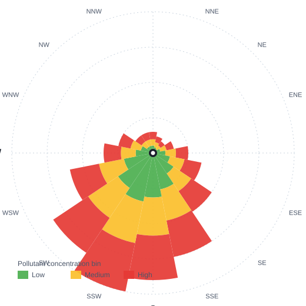

# Proposal — Refinery-Row Directional Air-Quality Modelling (Nueces County)

> 📝 **Live team draft (SharePoint) →** [**STX AQ Proposal.docx**](https://tamucc-my.sharepoint.com/:w:/r/personal/jtrevino79_islander_tamucc_edu/_layouts/15/Doc.aspx?sourcedoc=%7B1F7E1BF3-856B-46A6-8348-2B1D8BF57D76%7D&file=STX%20AQ%20Proposal.docx&action=default&mobileredirect=true&DefaultItemOpen=1&web=1)
> — Jasmine's shared TAMU-CC SharePoint doc where the three leads are
> collaboratively filling the Melaram-Lab proposal template. This
> markdown scope doc is the *snapshot / summary*; the SharePoint file
> is the *authoritative live draft*. Both are kept in sync at each
> bi-weekly meeting.

**Working title.** *Directional pollutant-transport modelling downwind
of the Port of Corpus Christi refinery corridor: a Random-Forest ×
pollution-rose analysis of SO₂ and Ozone over 2015–2025.*
(A health-outcome extension is [tabled below](#tabled-health-outcome-extension-future-work).)

**Origin.** [2026-07-15 team meeting](../meeting_notes/2026-07-15.md).
The proposal is a team synthesis:

- **Jasmine Trevino — foundational insight.** Introduced the
  **pollution-rose** framing (wind-rose analytics extended to show
  where each pollutant is *heading* at what severity). This is the
  anchor idea the rest of the design builds on. Jasmine also
  independently verified — with NWS Corpus Christi — that the Gulf
  sea-breeze pattern is uniform enough across the Coastal Bend for a
  single regional rose per pollutant per season to be scientifically
  defensible.
- **Manasa Kuchavaram — refinery-centering.** Proposed centering the
  pollution-rose analysis on the Port of Corpus Christi refinery
  corridor and pointed the team at R's
  [`openair`](https://davidcarslaw.github.io/openair/) package as the
  ready-made implementation path.
- **Aidan Meyers — ML methodology + pipeline engineering.** Extended
  the framing into a Random-Forest predictive model over the site ×
  time × meteorology tensor and built the underlying data pipeline.
- **Dr. Rajesh Melaram — grant + significance framing.** Immediately
  identified the design as the fix for the previously-denied
  climate-change seed grant (denied on feasibility, high on novelty +
  significance) and the R25 track.

**Status.** Consensus direction agreed at 2026-07-15. Refined at
[2026-07-29](../meeting_notes/2026-07-29.md) (K-fold stacked model +
Random Forest single-model start; **health-outcome layer explicitly
tabled** because BREATHE-CC target data is 1.5–2 years out) and
[2026-08-12](../meeting_notes/2026-08-12.md) (grad-level research
question, variables table, site scope). Warden/Jin joint session
pending (Schej poll being resent 2026-08-26).

### Design evolution log

| Date | Change |
|---|---|
| 2026-07-15 | Origin — three-lead synthesis (Jasmine pollution rose, Manasa refinery-centering, Aidan ML/health coupling) |
| 2026-07-22 | Waiting on Warden/Jin poll response; Ecuador 2017 PM2.5 wind-rose paper surfaced (Jasmine) |
| 2026-07-29 | Target-data reality check: BREATHE-CC unavailable 1.5–2 yr → **health-outcome layer tabled**; K-fold stacked design (base AQ model now, health stack layered later if data becomes available); Random Forest single-model start |
| 2026-08-12 | Research question refined to grad-level explicitness (AQ-only); variables table populated; site scope confirmed as 7 Nueces sites; Dr. Niyogi (UT Austin) collaboration signal |
| 2026-08-26 | Site-label catch reconciled (labels correct all along — CAMS/AQS ID confusion); scope doc restructured with health-outcome extension moved to tabled bottom section |
| 2026-09-20 | Site-specific TCEQ meteorology landed in Neon (`aq_coastal_bend.site_weather_hourly`) — 4 Nueces sites (25/26/32/34), 6 met parameters + derived u/v, 383k rows 2015-2025. Preferred over regional Open Weather feed for the base model's wind-direction inputs. |

**Team leads (equal weight).** Aidan Meyers, Manasa Kuchavaram, Jasmine
Trevino. Additional foundational credit to Jasmine for the
pollution-rose framing without which the proposal does not exist.

**Timeline.** 6–9 months to first manuscript submission on the base AQ
model (shorter than the original 1–1.5 yr because the health-outcome
extension is tabled, dropping the largest scope + data-acquisition
risk item).

<figure markdown>
  { width=440 }
  <figcaption><em>Illustrative pollution rose.</em> Each wedge points
  in the direction the wind is <strong>coming from</strong>; wedge
  length shows how frequently wind blows from that sector; wedge color
  bins represent pollutant concentration (green low → yellow medium
  → red high). The pattern here reflects the Corpus Christi Gulf-breeze
  regime — dominant winds from S / SSW — which is what the
  Refinery-Row design leverages. For real, data-driven examples see
  the <a href="https://davidcarslaw.github.io/openair/">openair R
  package</a>.</figcaption>
</figure>

---

## 1. The one-sentence pitch

> Use Random Forest with wind-direction and meteorological covariates
> to predict SO₂ and Ozone transport direction, speed, and
> concentration in the Corpus Christi Refinery-Row area over
> 2015–2025, and visualise the result as pollution roses centred on
> the refinery corridor.

## 2. Why this study is different (novelty case)

Almost every ML air-pollution study reduces the problem to
**predicting a scalar concentration at a monitor**. This proposal adds
a **directional transport component** anchored on a real industrial
point source (Refinery Row) and expresses the model's output as a
**pollution-rose visualisation** that is directly interpretable by
non-technical audiences (regulators, communities, policy).

Four dimensions that make this design distinctive:

1. **Point-source anchoring.** Refinery Row is a real, identifiable,
   legally-designated industrial corridor. Not a diffuse regional
   proxy.
2. **Directional exposure axis.** Wind direction is not just a
   predictor — it is the *organising axis* of the model output.
3. **Coastal-breeze effect quantification.** The literature has
   hypotheses but little clean evidence for how coastal sea-breeze
   regimes modify expected pollution–weather relationships; this
   design can produce direct measurement.
4. **Result-robust framing.** A model that predicts direction
   accurately but not concentration is publishable (Jasmine's
   hypothesis, §3). A null finding on concentration is publishable
   (speaks to whether the sea breeze is *protective* for corridor
   communities).

## 3. Research question

**Primary — refined at 2026-08-12.**
*Investigate the meteorological factors influencing SO₂ and Ozone
concentrations in the Corpus Christi Refinery-Row area using a Random
Forest model, over 2015–2025, with wind speed, wind direction,
temperature, heat index, humidity, atmospheric pressure, and
precipitation as candidate covariates. Can that prediction be
represented as a defensible pollution-rose visualisation?*

**Hypothesis (2026-08-12).** The Random Forest model will achieve
higher predictive accuracy on pollutant *transport direction* than on
*concentration*, because Corpus Christi's dominant south /
south-southwest sea breeze is remarkably constant across seasons
while concentration varies more freely with emission-source dynamics.
Sparse-direction sectors (winds from the north, which are rare) may
be under-predicted; addressable via class-balancing or acknowledged
in results.

**Exploratory.** Can predicted concentrations be mapped to AQI
categorical bands (green / yellow / orange / red / purple) as an
actionable family-facing output? (Jasmine's idea from 2026-07-08;
kept exploratory so it doesn't gate the primary analysis.)

## 4. Data availability (from 2026-08-12 + 2026-08-26 Neon verification)

| Pollutant | Coverage | Sites | Notes |
|---|---|---|---|
| Ozone (44201) | 🟢 10 yr | CC West, CC Tuloso | 2015–2025 continuous |
| SO₂ (42401) | 🟢 10 yr | 3 active sites | Every-6-day cadence; full 10-yr window justified |
| PM2.5 *(supplementary)* | 🟡 7 yr | 3 sites | 2018–2025; include as secondary analysis |
| PM10, VOCs, CO, NOₓ | — | | Out of scope for the base model |

Weather + wind:

- **`aq_coastal_bend.weather_hourly`** — regional Open Weather + Solcast
  (temp, humidity, pressure, precip, cloud cover, regional wind). 197k
  rows.
- **`aq_coastal_bend.site_weather_hourly`** *(v0.4.1, 2026-09-20)* —
  on-tower TCEQ met at 4 Nueces sites (25, 26, 32, 34): wind speed
  (resultant + scalar), wind direction (resultant + scalar), wind gust,
  ambient temperature. 383k rows, 2015-2025. This is the preferred
  wind-direction source for the base model because the sensor is
  co-located with the pollutant analyzer.

Hillcrest (29), Palm (83), Kingsville (314) do not have on-monitor met
and rely on the regional feed. Sea-breeze pattern uniform across
Coastal Bend per Jasmine's NWS-office verification.

See [`13_tceq_cams_aqs_reference.md`](../13_tceq_cams_aqs_reference.md)
for the authoritative site inventory and CAMS ↔ AQS mapping.

## 5. Methods overview

1. **Data harmonization.** Pull `aq_coastal_bend.pollutant_hourly` +
   weather; join on aqsid + timestamp. Preferred met join is
   `aq_coastal_bend.site_weather_hourly` (v0.4.1, on-tower TCEQ met
   at aqsid = 483550025 / 26 / 32 / 34) with fallback to
   `weather_hourly` (regional Open Weather) for the 3 sites without
   on-monitor met. Preserve method_code per row (2026-07-08 action
   item; ingest already does this for site-met via method_wind_*,
   method_temp_f columns).
2. **Site scope.** 7 active Nueces County sites near Refinery Row.
   Excludes CC Holly CAMS 660 (deactivated 2018), Kingsville, Kleberg.
   Optional additions under evaluation: CAMS 660 (Holly, 2015–2018
   pre-deactivation), CAMS 314 (National Seashore, active reference).
3. **Refinery Row coordinate.** Centroid of the Port of Corpus Christi
   industrial corridor (polygon, ~10 mi long; use midpoint for angular
   calculations, sensitivity-test with polygon boundary).
4. **Wind-direction encoding — 3 forms in parallel** (2026-08-12):
   - **Continuous degrees** (raw 0–360) — for reference. Prefer
     `wind_direction_resultant_deg`, fall back to
     `wind_direction_scalar_deg` (higher coverage: ~88% vs ~33%).
   - **Zonal (u) + meridional (v) decomposition** — standard
     atmospheric-physics encoding, avoids the 0°/360° discontinuity.
     The ingest pre-computes both `wind_u_ms`/`wind_v_ms` (from
     resultant) and `wind_u_scalar_ms`/`wind_v_scalar_ms` (from
     scalar); prefer resultant, fall back to scalar.
   - **16 categorical sectors** — for the pollution-rose visualisation
     only.
5. **Refinery-Row bearing (derived).** Angular difference between
   observed wind direction and the bearing from Refinery-Row centroid
   to each site.
6. **ML model — Random Forest, single-model start** (2026-07-29
   decision). No premature model shopping. Escalate to a second model
   (XGBoost, Neural Net) only if performance is unacceptable.
7. **K-fold protection against data leakage** (2026-07-29, Jasmine's
   NWS-lab pattern). 3-fold data split; primary training on folds
   1+2; fold 3 held out as a genuinely-unseen test set. Also usable
   as the training set for the tabled future health-outcome stack if
   that ever gets built.
8. **Pollution-rose figures.** Per pollutant, per season, per year.
   Rendered via [`openair::pollutionRose`](https://openair-project.github.io/openair/reference/pollutionRose.html)
   (Carslaw & Ropkins 2012).
9. **Sensitivity analyses.** Daily-completeness threshold (currently
   < 18 valid hours; treat as a knob); direction-encoding variants;
   drop-one-pollutant; seasonal subsets; wind-direction binning
   width.
10. **Imputation transparency** (2026-08-12). The final paper must
    report the **percentage of data imputed**, both overall and per
    pollutant. Missingness-pattern EDA precedes any imputation
    strategy choice.

### Variables table (from 2026-08-12 template fill)

**Pollutants (targets):**

| Variable | Operational definition | Unit | Type |
|---|---|---|---|
| SO₂ | Hourly ambient SO₂ (param 42401, method codes 100 + 92, UV-Fluorescence FEM); days with < 18 valid hours flagged incomplete | ppb | continuous |
| Ozone | Hourly ambient ozone (param 44201, method codes 56 + 87 + 187, UV Photometric FEM); same completeness flag | ppb → ppm | continuous |
| PM2.5 *(supplementary)* | Hourly ambient PM2.5 (param 88101 + 88502; see [PM2.5 deep-dive](../pollutants/pm25.md) for method-code timeline) | µg/m³ | continuous |

**Meteorological (predictors):**

| Variable | Notes | Type |
|---|---|---|
| Wind speed | Hourly | continuous |
| Wind direction | Encoded 3 ways (see §5 step 4) | continuous + categorical |
| Refinery-Row bearing | Derived — angular offset from R-Row centroid to site vs observed wind direction | continuous |
| Temperature | Hourly | continuous |
| Heat index | Hourly, derived | continuous |
| Humidity | Hourly relative humidity | continuous |
| Atmospheric pressure | Hourly | continuous |
| Precipitation | Hourly rainfall (mm); binary "is raining" indicator | continuous + binary |
| Cloud coverage | Frontal-system / sea-breeze-thunderstorm indicator | continuous |

**Time features:** hour, season, year.

**Supplementary (documented, not fed to model):** method code per row.

**Exploratory target:** AQI categorical band.

**Excluded — documented as limitations:**

- **Wind gusts** — too sparse in Open Weather (mostly null); would
  require ≥ 60% cell-fill to be usable for RF splits.
- **Boundary layer height + temperature inversion** — reliable data
  requires 12-hr weather-balloon feeds we do not have access to.

## 6. Team + collaborators

### Core team (equal-weight leads)

- **Jasmine Trevino** — meteorology + wind analytics + SO₂ deep-dive;
  originator of the pollution-rose framing; primary lead on the
  wind-direction and pollution-rose analytics.
- **Manasa Kuchavaram** — chemistry + ozone deep-dive + literature
  review; originator of the refinery-centering approach; primary lead
  on ozone + `openair` implementation.
- **Aidan Meyers** — pipeline engineering + ML modelling + PM/VOC
  deep-dive; primary lead on the Random Forest model and
  exposure-axis construct.
- **Dr. Rajesh Melaram** — PI; grant strategy, translation to policy,
  connection to future health-outcome work.

### To loop in for the joint consult

- **Dr. Warden** — methodological / stats. (Schej poll being resent
  2026-08-26.)
- **Dr. Jin** — methodological / stats. (Same poll.)
- **Jasmine's atmospheric-physics mentor** — atmospheric-physics
  consult, especially on wind-direction encoding for the ML model.
- **Dr. Deb Niyogi — UT Austin, Extreme Weather + Urban
  Sustainability Lab.** Discovered at 2026-08-12 via Jasmine's UT
  Austin interview. Overlap: thunderstorm × aerosol × asthma.
  Relevant when the health-outcome extension is un-tabled; not on the
  critical path for the base model.

## 7. Publication + policy framing

- **Target journal (base model).** Environmental Modelling & Software
  (impact ≈ 5, methodological fit); Atmospheric Environment (≈ 5); or
  Environmental Research (≈ 8) if the pollution-rose × refinery
  angle carries enough novelty. If a health-outcome extension is
  eventually appended, upgrade candidates: Environmental Health
  Perspectives (≈ 10), Environment International (≈ 12).
- **Policy angle.** Refinery-corridor pollutant transport
  characterisation at hourly resolution is directly actionable for:
  - Corpus Christi + Nueces County zoning + industrial permitting.
  - Texas Commission on Environmental Quality (TCEQ) monitoring
    strategy — the pollution rose can indicate where additional
    monitors would add the most information.
  - EPA facility-permitting reviews.
- **Grant reuse.** The climate-change seed grant that Dr. Melaram
  submitted (denied on feasibility, high on novelty + significance)
  directly addresses this study's shape. Resubmit anchored on this
  proposal.

## 8. Comparison paper the team will position against

Search-and-comment target: the **Houston longitudinal PM study** the
team cited in the last paper. It did not discuss instrument changes;
ours will. It did not do directional exposure attribution; ours will.
Systematic comparison in the discussion section positions our
methodological contributions.

## 9. Deliverables

- **v1 (~2026-09-09):** analytical tibble frozen; first pollution-rose
  figures rendered; literature review consolidated.
- **v2 (~2026-10):** Random Forest base model trained; sensitivity
  analyses started; methods draft.
- **v3 (~2026-11):** manuscript first draft; team review.
- **v4 (~2026-12):** submission to target journal.

Timeline shortened by ~6 months from the pre-2026-07-29 plan because
the health-outcome extension is tabled and no longer gates the
manuscript.

## 10. Risks + mitigations

| Risk | Mitigation |
|---|---|
| Novelty risk — someone has done this | Novelty scan complete (see companion literature list). Recent Houston sea-breeze × PM2.5 papers exist but do not do refinery-centred pollution-rose + Random Forest at our specific site scope. |
| Wind-direction encoding non-trivial for ML | Reason we're bringing in Dr. Warden + Dr. Jin + atmospheric-physics consult; 3-form parallel encoding (§5 step 4). |
| Refinery Row treated as a point when it's a polygon | Model both — sensitivity analysis. |
| Sea-breeze uniformity assumption breaks in southernmost Coastal Bend | Jasmine's NWS-office verification says it holds for Coastal Bend proper; scope excludes deep Rio Grande. |
| Method-code shifts confound multi-year analysis | Redo raw ingest to preserve method_code per row (2026-07-08 action item); document per-site method-code timeline in supplement. |
| RF over-fits on sparse rare-direction sectors | K-fold split; class-balancing; acknowledge as limitation. |

## 11. Companion documents

- [2026-07-15 meeting notes](../meeting_notes/2026-07-15.md) — origin
  discussion.
- [2026-07-29 meeting notes](../meeting_notes/2026-07-29.md) — the
  meeting where the health-outcome extension was tabled and the
  K-fold RF direction was set.
- [2026-08-12 meeting notes](../meeting_notes/2026-08-12.md) —
  research-question refinement + variables + site scope.
- [13. TCEQ CAMS ↔ AQS site reference](../13_tceq_cams_aqs_reference.md)
  — authoritative site inventory.
- [Pollutant deep-dives](../pollutants/pm25.md) — per-pollutant
  technical context.
- [Pipeline Updates](../pipeline_updates.md) — running change log.

## 12. Open questions the joint session should resolve

- Directionality encoding: continuous angle vs binned sectors vs
  polar-coordinate embedding — which does Random Forest split best?
- Cone width for the "downwind" definition — literature standard or
  empirical?
- Should we build the model as **hazard-detection** (categorical
  AQI-colour target from Jasmine's idea) or as **concentration
  regression**?
- Cleanest validation strategy — hold-out year, spatial
  cross-validation by site, or both?

---

## Tabled: Health-outcome extension (future work)

> ⏸ **Status — TABLED as of 2026-07-29.** The health-outcome layer of
> the original proposal is explicitly deferred. Two reasons:
>
> 1. **BREATHE-CC target-data lag.** Dr. Melaram (2026-07-29 meeting):
>    *"Definitely not happening. Two more years — at least a year and a
>    half."* The BREATHE-CC pediatric cohort needs ≥ 150 participants
>    before a cohort-profile paper (its own prerequisite) can even land.
>    Any health-outcome ML using BREATHE-CC targets is a 2027+ project.
> 2. **Base model is publishable on its own.** The current-scope base
>    AQ model (§1–§9 above) is a defensible, self-contained methodological
>    contribution. Waiting on health data was the largest scope + timeline
>    risk in the original proposal.
>
> The base model is designed with a **K-fold split that reserves fold 3
> as an unseen test set** — precisely so a future health-outcome stack
> can be added later without contaminating the base model's evaluation.
> The tabled framing preserves this future path without gating current
> deliverables on it.

### What the tabled extension would add

If (and only if) target-outcome data becomes available at
residential-zone × time resolution:

- **Primary (future) research question.** Does wind-direction ×
  predicted-pollutant-flow from Refinery Row at time T significantly
  predict acute respiratory and cardiovascular exacerbations (ED
  visits, hospitalizations) at downwind residential zones at time
  T + Δ (Δ ∈ hours, days, weeks)?
- **Secondary (future).** Optimal Δ; which pollutant mediates most
  strongly; sea-breeze attenuation vs redistribution; seasonal
  phase-shift over 2015–2025.
- **ML architecture (future).** Second stack on top of the base model
  — takes the base model's out-of-fold predictions as input, targets
  health-outcome incidence.

### Candidate health-outcome data sources

- **BREATHE-CC pediatric cohort (Melaram Lab).** Ideal (real people,
  geocoded, consented) but ≥ 2027 earliest.
- **Texas DSHS public-use ED-visit data** (Manasa's 2026-07-29 find).
  Request-based; slow but obtainable in principle.
- **Texas HHSC hospital discharge dataset.** Statewide, residentially
  geocoded, requires DUA.
- **Dr. Deb Niyogi lab (UT Austin).** Already holds thunderstorm ×
  aerosol × asthma health data; collaboration exploration is
  independent of this project's critical path.

### Candidate outcomes (if data arrives)

Asthma exacerbations (ICD-10 J45.x), COPD exacerbations (J44.x),
acute bronchitis (J20), cardiovascular incidents (I20–I25, I50),
all-cause respiratory admissions (J00–J99). Optional secondary:
neonatal / obstetric outcomes (Bekkar 2020 framework — PM2.5 &
preterm birth).

### Reactivation criteria

Un-table this extension if **any** of the following happens:

1. BREATHE-CC reaches the 150-participant threshold with clean
   geocoding.
2. A Texas DSHS or HHSC DUA is approved and data delivered.
3. The Dr. Niyogi collaboration formalises with a data-sharing
   agreement covering asthma / aerosol trajectory records.

Reactivation is a re-scoping decision, not a mid-project pivot —
plan on a 2–3 month scope refresh before analysis resumes.
